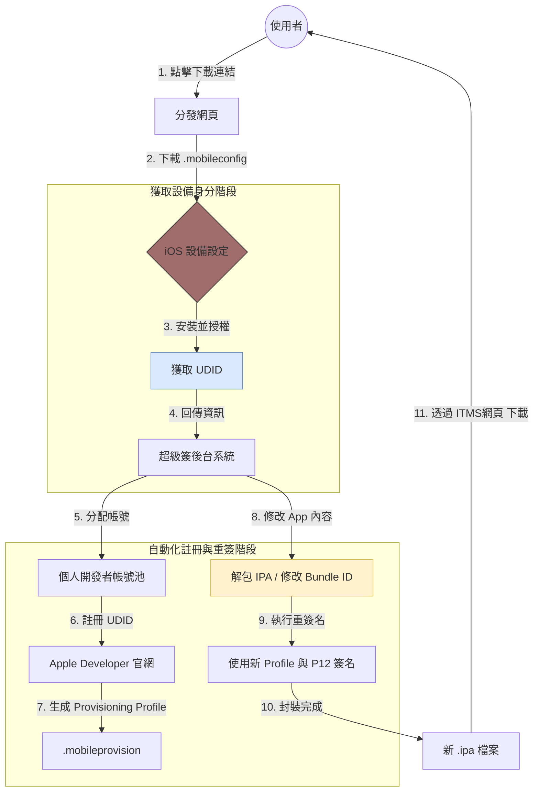

# 關於Apple憑證和簽名模式簡述

本文件旨在總結蘋果開發體系中，「身分驗證」與「安裝授權」的底層關係，並詳細解析 App Store、企業簽與超級簽的技術差異。

---

## 一、 基礎設施：憑證與描述檔的關係

在 Apple 的安全模型中，App 能否運行取決於**「你是誰」**以及**「你被允許做什麼」**。

### 1. 憑證 (Certificates) —— 「身分證」
* **本質**：數位簽章，證明開發者的合法身分。
* **關鍵組件**：包含一個 **私鑰 (Private Key)** 與一個 **公鑰 (Public Key)**。私鑰存於你的 Mac (Keychain)，公鑰包含在憑證中。
* **作用**：確保 App 來源可靠，且代碼未被第三方篡改。

### 2. 描述檔 (Provisioning Profile) —— 「通行證」
描述檔是一個聯結器（Linker），它將以下四個關鍵要素「封裝」在一起：
* **Certificates**：誰簽名的？
* **App ID**：哪款 App？ (例如 `com.test.app`)
* **Devices**：哪些設備可以裝？ (UDID 列表)
* **Entitlements**：擁有什麼權限？ (推送、iCloud、Pay...)

---

 

## 二、 簽名模式全對比

當 App 需要分發給使用者時，根據帳號類型與分發路徑的不同，其特性差異如下：

| 特性              | App Store (個人/公司) | 企業簽 (Enterprise)     | 超級簽 (Super Sign)       |
| :---------------- | :-------------------- | :---------------------- | :------------------------ |
| **目標對象**      | 全球大眾使用者        | 僅限公司內部員工        | 無法過審或規避審核的應用  |
| **官方審核**      | **需要** (極其嚴格)   | **不需要**              | **不需要**                |
| **安裝限制**      | 無限制                | 無限制 (需手動信任)     | 每個帳號限 100 台設備     |
| **Bundle ID**     | **不可更改**          | **不可更改**            | **通常會被修改**          |
| **穩定性**        | 最高 (永不掉簽)       | 中 (易因違規被全體封號) | 高 (帳號獨立，風險分散)   |
| **Keychain 繼承** | 正常繼承              | 正常繼承                | **無法繼承 (數據會丟失)** |

---

## 三、 超級簽的技術運作與「改 ID」的影響

### 1. 超級簽的第一步：關鍵的 `.mobileconfig`
在超級簽的流程中，使用者必須先安裝一個「描述檔」。這與開發用的憑證不同，它的正式名稱是 **行動裝置管理描述檔 (Mobile Configuration Profile)**。

### 2. 為什麼要裝這個？
* **核心目的**：獲取設備的 **UDID (唯一設備識別碼)**。
* **技術原理**：利用 iOS 的 MDM 協定，引導系統將設備資訊加密回傳至伺服器。
* **使用者體驗**：這就是為什麼流程中會跳轉到「系統設定」並要求輸入開鎖密碼的原因。

### 3. 安全性警告
* 該描述檔會觸發 iOS 的紅色警告訊息。
* 服務商拿到 UDID 後，才能在後台自動將該設備加入開發者帳號的 100 人名單中。

1.  **UDID 獲取**：引導用戶安裝 Mobile Config 檔案，取得手機識別碼。
2.  **後台自動化**：服務商腳本自動將 UDID 加入其中一個個人帳號。
3.  **重簽 (Re-sign)**：解包 `.ipa`，修改 `Bundle ID`，用對應的描述檔重新打包。

### 補充說明：關鍵協議 itms-services
* **定義**：Apple 私有的無線安裝協議 (OTA)。
* **作用**：繞過 App Store，直接透過瀏覽器下載並觸發系統級的安裝彈窗。
* **文件依賴**：必須搭配一個 HTTPS 的 `.plist` (Manifest) 檔案。該檔案指向最終重簽名後的 `.ipa` 路徑。
* 連結格式通常長這樣： `itms-services://?action=download-manifest&url=https://example.com/manifest.plist`
<!-- ### 4. 改 ID 對 Keychain 的致命打擊
當超級簽修改了你的 `Bundle ID` 與 `Team ID`：
* **Keychain Access Group 變更**：iOS 根據 `TeamID + BundleID` 劃分 Keychain 區域。一旦改變，App 就像換了一個人，**舊的 Token、帳號密碼、設備唯一識別碼通通讀不到**。
* **無法覆蓋安裝**：系統會視其為兩個獨立的 App，這會導致使用者更新後必須重新登入，且舊數據無法搬遷。 -->

---

## 四、 維護常見問題 (Troubleshooting)

### Q1：為什麼會「掉簽」？
**原因:**
1. Apple 偵測到企業帳號被用於非內部員工的分發（如博弈、破解版），主動撤銷（Revoke）憑證。
2. 超級簽的個人帳號方式，如果短時間大量註冊裝置，且全是不同區域的，仍可能會封鎖該帳號。
3. 憑證過期。描述檔內含的憑證超過 1 年效期。
4. 網路問題。首次啟動需連網驗證，若無法連線至 Apple 伺服器則無法開啟。
* **後果**： 所有已安裝的設備點開 App 會立即閃退，且無法再驗證。

---

## 五、 總結

* **一般商業 App**：優先選擇 **App Store**，雖然審核慢，但安全性與穩定性最高。
* **大型企業內測**：使用 **企業帳號**，但現在帳號申請變得非常困難，蘋果審核標準變得很嚴格。
* **快速買量/灰產**：使用 **超級簽**，但需在代碼中處理好「Bundle ID 變更」後的數據相容問題，也需要和使用者教學安裝操作。

